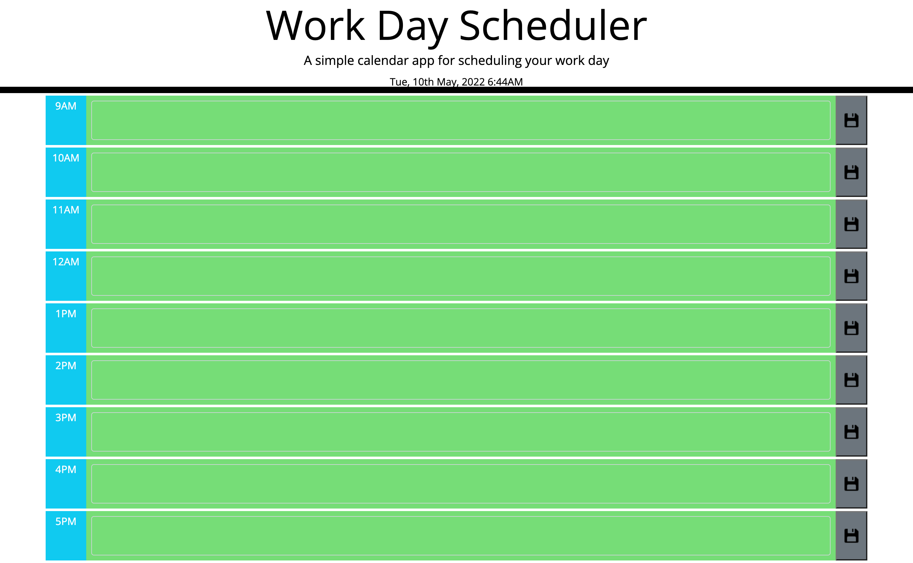

# work-day-planner

A planner that uses jquery and javascript.

## Deployed URL

Click the link [here](https://amirtha-coder.github.io/work-day-planner/) to access the webpage.

## Screenshots

### Work-day-planner

## Technologies

- html
- css
- coolers
- javascript
- jquery
- git

## Previous projects

- #### Project 1: semantic HTML and adding CSS to refactor the webpage for a marketing agency. Click the link [here](https://winner-am1.github.io/semantic_html_refactor/) to access the webpage.
- #### Project 2: My professional portfolio created using HTML and CSS.Click the link [here](https://amirtha-coder.github.io/amirtha-portfolio/) to access the webpage.
- #### Project 3: My random password generator created via javascript. Click the link [here](https://amirtha-coder.github.io/random-password-generator/) to access the webpage.
- #### Project 4: To create this timed code quiz I had to used HTML, CSS, Javascript and Web APIs. Click the link [here](https://amirtha-coder.github.io/timed-code-quiz/) to access the webpage
